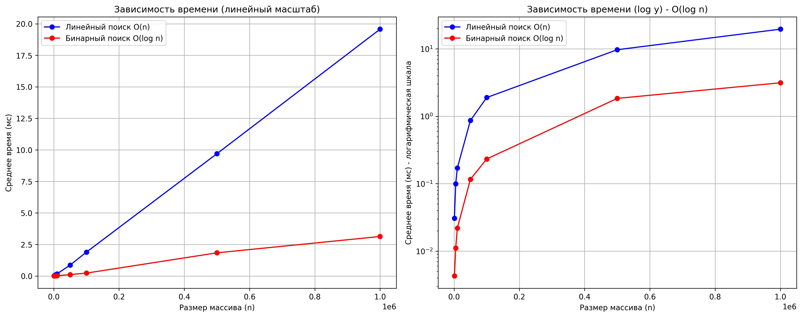

# Лабораторная работа 01: Введение в алгоритмы. Сложность. Поиск

**Дата:** 2025-10-03
**Семестр:** 3 курс 1 полугодие - 5 семестр
**Группа:** ПИЖ-б-о-23-2(2)
**Дисциплина:** Анализ сложности алгоритмов
**Студент:** Фуфаев Никита Александрович  

---

## Цель
Освоить понятие вычислительной сложности, реализовать линейный и бинарный поиск, подтвердить O(n) и O(log n) (см. 01_lab01).

---

## Теория
- Сложность: Ресурсы для n (теория 01_lab01).
- O-нотация: Худший случай (01_lab01).
- Линейный поиск: O(n).
- Бинарный поиск: O(log n) после сортировки O(n log n).

---

## Реализация
- Файл: `search_comparison.py`.
- Функции: `generate_data`, `prepare_targets`, `linear_search`, `binary_search`, `measure_time`, `plot_results`.
- Запуск: `pip install matplotlib timeit`; `python search_comparison.py`.

---

## Результаты
- Замеры: n=1000–1e6, усреднено по 10 запускам/4 целям.

---

## Детальный анализ
1. Теория (01_lab01): O(n) для линейного, O(log n) для бинарного.
2. Практика: Линейный - линейный рост, бинарный - логарифмический (log y плоский).
3. Тестовые данные (шаг 3, 01_lab01): Первый (O(1)), последний (O(n)), средний (O(n/2)), отсутствующий (O(log n)) - все сценарии.
4. Сравнение: Теория подтверждена; расхождения - константы Python.
5. Ограничения: До 1e6 стабильно; большие n требуют оптимизации.

---

## Характеристики ПК
- Процессор: AMD Ryzen 9 8945HX with Radeon Graphics   
- ОЗУ: 16 GB 
- ОС: Windows 11
- Python: 3.9.7

---

## Версионный контроль
GitHub Flow: main + feature/lab01, PR.

---

## Вывод
Работа соответствует 01_lab01; теория подтверждена практикой.

## Приложения
- [Исходный код программы](./search_comparison.py) 
- Графики:
